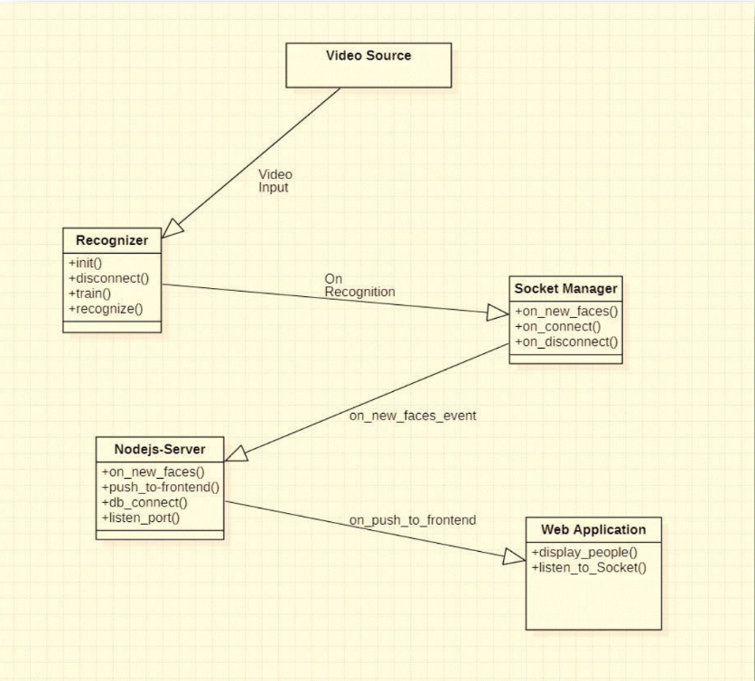
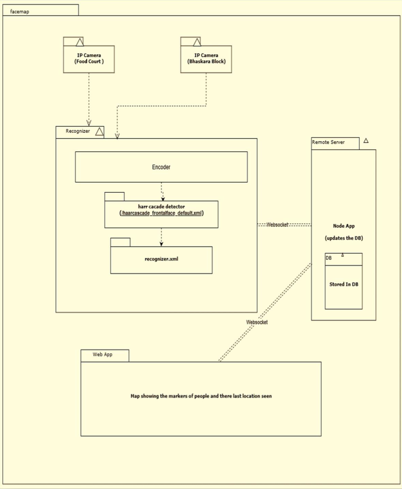

# Real-Time Surveillance System

🚀 **An academic project leveraging cutting-edge technologies like OpenCV, Flutter, ExpressJS, Flask, and MongoDB to build a real-time surveillance system.** 

This project focuses on real-time video streaming, object tracking, facial recognition, and motion detection with notification alerts for security purposes.

---

## 🔑 Key Features

- **📹 Real-Time Video Streaming**: Stream and monitor live video feeds in real-time.
- **🎯 Object Detection & Tracking**: Identify and track objects within the surveillance area.
- **👤 Facial Recognition**: Recognize and track specific individuals for enhanced security.
- **🚨 Motion Detection**: Detect movement and trigger notifications when unexpected activity occurs.
- **🔔 Alerts & Notifications**: Receive instant alerts for critical events such as motion or facial recognition.

---

## 🛠️ Tech Stack

The project uses the following technologies:


---

## 🗂️ Project Structure

### UML Diagram



### Flowchart



---

## 🎥 Demo

[](https://youtu.be/XlDWZ4XkOiQ "Real-Time Surveillance System - Click to Watch!")

---

## 🚀 Getting Started

### Prerequisites

Ensure you have the following installed:

- **Git**
- **Node.js**
- **Flutter SDK**
- **Python**
- **MongoDB**

### Installation

Follow these steps to set up the project:

1. Clone the repository:
    ```bash
    git clone https://github.com/your-username/realtime-surveillance-system.git
    ```

2. Install backend dependencies:
    ```bash
    cd realtime-surveillance-system
    npm install
    ```

3. Start the backend server:
    ```bash
    npm start
    ```

4. Start the frontend (mobile app):
    ```bash
    cd frontend
    flutter run
    ```

---

## 🤝 Contributing

We welcome contributions! Feel free to:
- Open issues for feature requests or bugs.
- Submit pull requests with improvements or new features.

---

## 📄 License

This project is licensed under the **MIT License**. See the [LICENSE](LICENSE) file for more details.

---

### 📬 Contact

For any inquiries or questions, feel free to reach out via [LinkedIn](https://www.linkedin.com/in/puneethregonda/).
